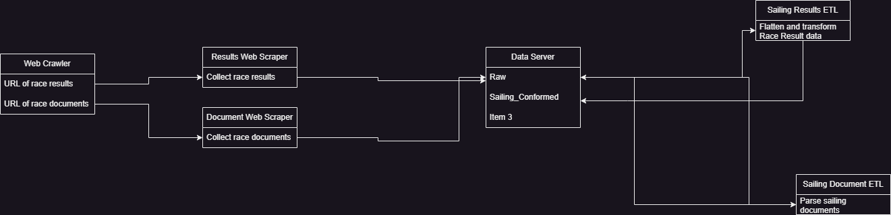

# Regatta Network Data Mining and Weather Analysis

## Introduction
The competitive sailing world pushes the limits of technology in boat design, sail design, and instrumentation. Large data analysis of race results for competitive sailing is an unexplored area that could provide insights not only to individual competitors but also provide overall analysis of boat design performance. Combining big data race results with the historical weather data from the event would open up powerful analysis opportunities.

## Project Overview
To create a public-facing website that will provide analysis of big data race results combined with historical weather data and other relevant information. The website would have an API that would allow for querying of race result data.

## Functional Requirements

### Data Collection

#### Race Results
- **Web scraping competitive sailing regatta websites**, primarily being RegattaNetwork. This will be done using a Python script and set to an automated schedule to collect new data as it becomes available.
    - **Web crawler**: Program that will collect URLs of pages that need to be scraped.
    - **Scraper**: Program that will collect data from the HTML web page for ingestion. Error on the side of collecting more data.

#### Weather
- Create a metadata CSV to map yacht club locations and races to approximate geographic areas. Using AI technology and the web scraped data, provide a guess as to the sailing area. Manually adjust the mapping as needed.
- Program that will scrape sailing instructions for the time-of-day the race will take place.
- Program that will take a list of sailing areas, date, and time of day to gather the NOAA historical weather data. Ingest the data and ETL downstream to provide usable information.

### Database Architecture
- Create POC of data collection and ingestion in a local MySQL server. Once POC is completed, migrate to an Azure or AWS ecosystem.

### Data Ingestion

### Website Design

### Hosting

### UI

### API